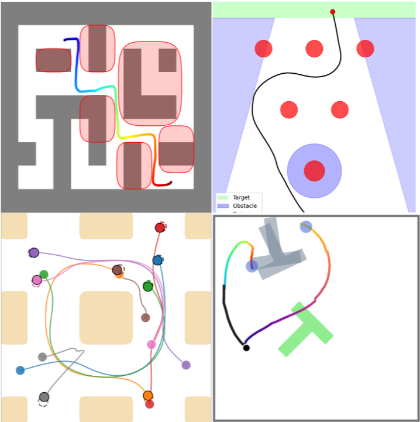

  

# Hello there - I am Paolo! 👋

I am a Master's student in Mechanical Engineering and Data Science at _EPFL_. Currently I am a visiting researcher at _MIT_ at the Laboratory of Information and Decision Systems under Prof. Navid Azizan.

My path has been interdisciplinary, shaped by interests spanning mathematics, physics, chemistry, computer science, aviation, and mechanical engineering. Today, my research interests are primarily based on safe and reliable generative AI, particularly diffusion and flow matching models.

Feel free to explore my repositories and connect with me!

## Connect with me:

## Recent Works

<table>
  <tr>
    <td width="28%" valign="top">
      
    </td>
    <td valign="top">
      <strong>DiRecT: Safe Diffusion-Based Planning via Receding-Horizon Denoising</strong> 
      Paolo Giaretta, Zeyang Li, and Navid Azizan 
      <em>Under review for NeurIPS 2026</em>  
      Giaretta, P., Li, Z., & Azizan, N. (2026). DiRecT: Safe Diffusion-Based Planning via Receding-Horizon Denoising. arXiv:2606.15359.  
      
      
    </td>
  </tr>
</table>

